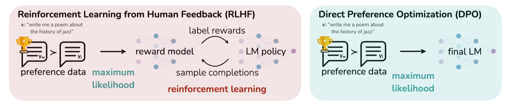
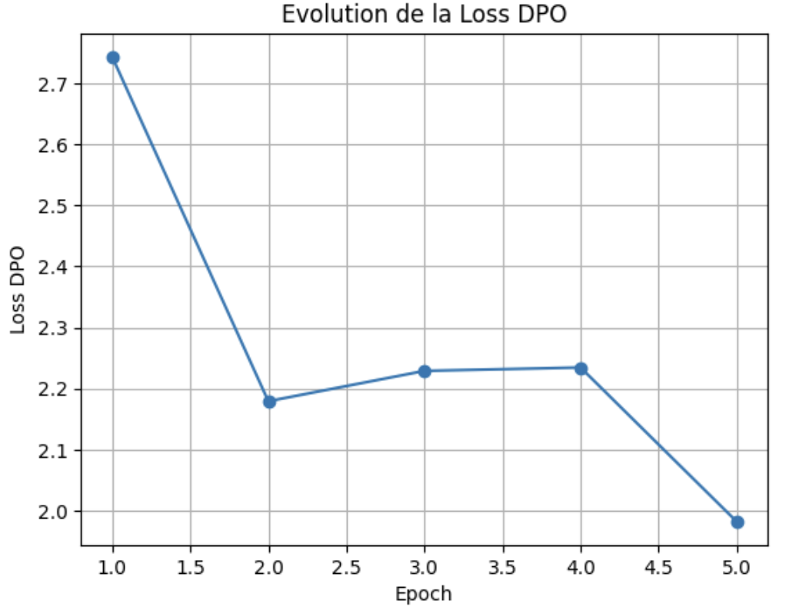
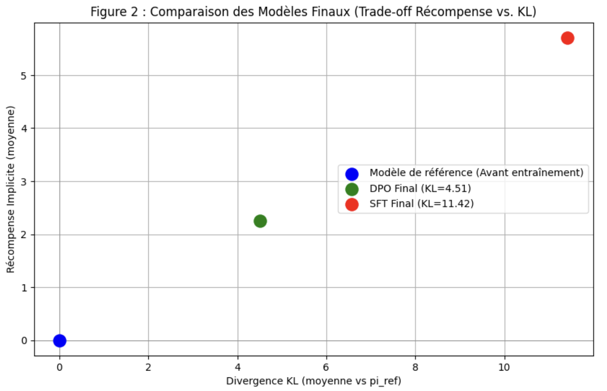
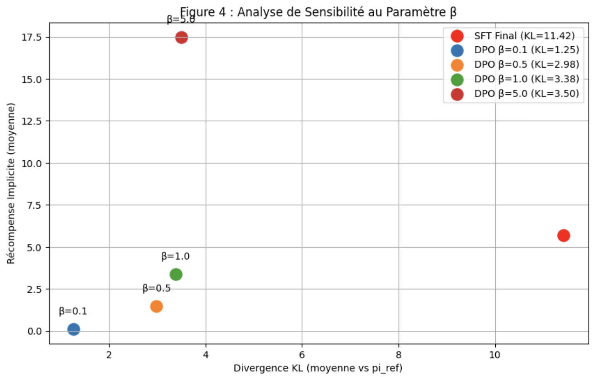

# Direct Preference Optimization (DPO) Implementation on GPT-2

This project is a PyTorch implementation of the **Direct Preference Optimization (DPO)** algorithm, a state-of-the-art technique for fine-tuning Large Language Models (LLMs) with human preferences. The base model used is `gpt2`, and it is fine-tuned on the *Helpful and Harmless* (HH-RLHF) dataset. The goal is to benchmark its performance against a standard Supervised Fine-Tuning (SFT) baseline.

This work is a practical application of the concepts from the Stanford research paper: **"Direct Preference Optimization: Your Language Model is Secretly a Reward Model"**.


---

## 1. Context: DPO vs. Traditional RLHF

Aligning LLMs with human preferences is a crucial step to ensure their safety and utility. The standard method, **Reinforcement Learning from Human Feedback (RLHF)**, is a complex, multi-stage process:

1. **Supervised Fine-Tuning (SFT):** Fine-tuning the base LLM on a high-quality dataset.  
2. **Reward Modeling:** Training a separate reward model to learn human preferences from a dataset of ranked responses.  
3. **RL Fine-Tuning:** Further fine-tuning the SFT model using a reinforcement learning algorithm (like PPO) guided by the reward model.

**Direct Preference Optimization (DPO)** offers a simpler and more stable alternative. It eliminates the need for a separate reward model and a complex RL loop. Instead, DPO uses preference data directly to adjust the LLM's policy, treating it implicitly as its own reward model by optimizing a simple classification-style loss on preference pairs.

**Advantages of DPO:**
* **Simplicity:** No reward model to train, no complex sampling required.  
* **Stability:** Easier to train and less sensitive to hyperparameters than PPO.  
* **Efficiency:** Less computationally and memory-intensive.

---

## 2. Project Pipeline

This project implements a complete pipeline to compare the effectiveness of DPO.

* **Models:** Three models are trained and compared:
  1. **Reference Model (`pi_ref`)** — the original, unmodified pre-trained `gpt2` model.  
  2. **SFT Model (Supervised Fine-Tuning)** — `gpt2` fine-tuned only on the "chosen" (preferred) responses from the dataset.  
  3. **DPO Model (`pi_theta`)** — `gpt2` fine-tuned using the DPO loss function, which learns directly from preference pairs.  
  For the SFT and DPO models, the **first 8 layers of the Transformer are frozen** to preserve the base model's knowledge while adapting its higher-level representations and stabilizing training.

* **Dataset:** `Anthropic/hh-rlhf`, containing triplets of `(prompt, chosen_response, rejected_response)`.

* **Training:** The training loop is implemented in PyTorch and uses:
  * `RMSprop` optimizer,
  * a linear warm-up scheduler,
  * gradient clipping for stability,
  * a learning rate of `1×10⁻⁶` (used in these experiments for stability).

* **Evaluation:** Performance is measured along two axes (as in the original DPO paper):
  * **Implicit Reward:** Measures how well the model aligns with the preference data (empirically calculated as the expected β-scaled log-ratio between `π_θ` and `π_ref` on chosen responses).
  * **KL Divergence (E[KL(π_θ || π_ref)]):** Measures how much the model's policy has deviated from the reference model. Lower KL indicates better fidelity to the base model.

---

## 3. Results and Analysis

The script generates several key analyses to evaluate the performance of the DPO algorithm. The following sections summarize the main outcomes observed in our experiments.

### DPO Loss Evolution
The DPO loss decreased steadily over training epochs, indicating the model learned to prefer chosen responses over rejected ones. This decline in loss aligns with successful optimization of the DPO objective and improved alignment with human preference labels.



### Model Comparison (DPO vs. SFT vs. Reference)
We plot each model on a **Reward vs. KL Divergence** axis to visualize the reward–fidelity trade-off.

* The **SFT** model obtains a high implicit reward but at the cost of a very large KL divergence (measured `KL ≈ 11.42`), indicating it diverged substantially from the reference policy and exhibited degenerative behaviors in generations.  
* The **DPO** model achieves a strong positive implicit reward while maintaining a much smaller KL divergence (`KL ≈ 4.51`), demonstrating a better trade-off and showing that DPO can push reward while preserving base capabilities.  
* The **Reference** model sits at low reward / low KL (by definition KL=0 vs itself).

These findings validate the core hypothesis of the DPO paper: DPO provides a superior reward vs. KL trade-off compared to naive supervised fine-tuning on preferred responses.



### Sensitivity Analysis of the β Parameter
The `beta` (β) parameter in the DPO loss controls the strength of the KL constraint. We ran a sensitivity sweep over several β values and observed the expected theoretical relationship:

Reward ≈ β * KL


Empirically:
* Lower β → smaller KL and lower reward.  
* Higher β → larger KL and higher reward.  
* In our experiments, **β = 0.5** provided a good balance between reward improvement and controlled divergence from the reference policy.



### Qualitative Analysis of Generations
We show sample generations for the three models to qualitatively assess behavior.

| Prompt                                | Reference Model (GPT-2) | SFT Model (Supervised FT) | DPO Fine-Tuned Model |
| :------------------------------------ | :----------------------: | :-----------------------: | :------------------: |
| "What are some fun things to do in Paris?" | *(Base model response — generic sightseeing tips)* | *(SFT tends to provide similar tips but shows occasional repetitive or off-topic phrases in extreme cases)* | *(DPO: coherent, helpful list focusing on museums, neighborhoods, food, and practical tips)* |
| "How can I learn to code for free?" | *(Short, generic pointers — recommend online tutorials)* | *(Collapsed/looping or repetitive text for some seeds — symptomatic of uncontrolled SFT divergence)* | *(Clear, structured learning path: recommended resources, project ideas, free course links, next steps)* |
| "What is the meaning of life?"        | *(Philosophical, sometimes vague)* | *(Repetitive or hallucinated factual claims in some seeds)* | *(Balanced, reflective answer with disclaimers and structured viewpoints)* |

**Illustrative example (one problematic SFT generation):**  

"I'm a software engineer. I'm a software engineer. I'm a software engineer. ..."

This repetition illustrates how SFT, when trained solely on chosen responses without a KL constraint, can collapse into degenerate loops for some prompts. In contrast, the DPO model keeps outputs coherent and relevant, demonstrating how the implicit KL regularization in DPO helps maintain generation sanity.

**Summary of main quantitative results:**
* **SFT:** High reward but extremely high KL (KL ≈ 11.42) — unstable behavior.  
* **DPO:** High reward with moderate KL (KL ≈ 4.51) — best practical trade-off in these experiments.  
* **Reference:** Baseline performance with low KL (by definition) but lower reward.

---

## 4. How to Run

### Prerequisites
* Python 3.8+  
* PyTorch & CUDA-enabled GPU (e.g., T4 on Google Colab)  
* Python packages: `transformers`, `datasets`, `tqdm`, `matplotlib` (plus any extras in `requirements.txt`)

### Installation

1. **Clone the repository:**
```bash
git clone https://github.com/Ethan0991/Direct-Preference-Optimization-Implementation.git
cd Direct-Preference-Optimization-Implementation
```
2. **Install Dependencies:**
```bash
pip install requirements.txt
```

## 5. Running the Script

Ensure you are in an environment with a GPU available.
The script will:

1 - Download the dataset and the base model from Hugging Face.
2 - Train and evaluate the SFT baseline model.
3 - Train and evaluate the main DPO model.
4 - Run the sensitivity analysis for the beta parameter.
5 - Display the result plots and generation examples.
6 - Save the final DPO model to dpo_gpt2_model_final/

## 6. Notes, Caveats & Tips

- **Freezing early layers:** Freezing the first 8 transformer layers stabilizes training and preserves base knowledge — consider tuning the number of frozen layers depending on compute/resources and dataset size.

- **Learning rate & optimizer:** We used `RMSprop` with a small LR (`1×10⁻⁶`) for stability in this experimental setup. Different optimizers (e.g., `AdamW`) and learning rates may also work; validate on development splits.

- **Evaluation:** Besides implicit reward and KL, consider human evaluation and safety checks when deploying preference-aligned models.

- **Degeneration risk in SFT:** The SFT baseline can degenerate (high KL, repetition, hallucinations). DPO’s KL-aware objective reduces such risk.

- **Reproducibility:** Save random seeds, dataset splits, and model checkpoints to make experiments reproducible.

## 7. Reference

**Direct Preference Optimization: Your Language Model is Secretly a Reward Model**  
Rafael Rafailov, Archit Sharma, Eric Mitchell, Stefano Ermon, Christopher D. Manning, and Chelsea Finn.  
[Link to Paper (arXiv)](https://arxiv.org/abs/2305.18290)
